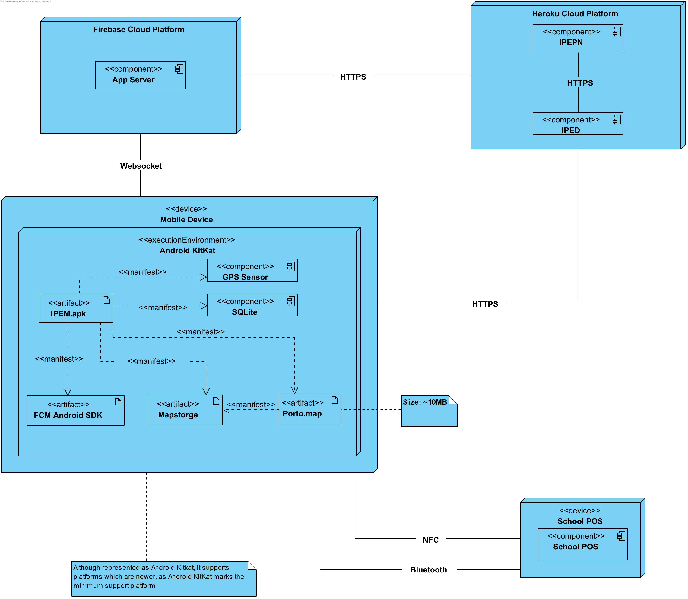

# Iteration 1

**Step 1**

- Goal: Review Inputs

- Possible Questions:

|Question|Answer|
|--------|------|
|Inputs available and correct?|As far as the feedback of the stakeholder, the defined architectural drivers are correct|
|All drivers available?|As far as what was retained from the domain problem and the stakeholder feedback, all drivers have been defined|
|Is it clearly stablished what is the purpose for the design activities?|Yes, the purpose of this iteration is to structure the application architecture in a coarse-view|
|Have primary functionality and quality attribute scenarios been prioritized (ideally by the most important project stakeholders)?|Yes|
|Are initial architectural concerns defined?|Yes|

**Step 2**

- Goal: Establish iteration goal by selecting drivers

#### Kanban Board

| Not Addressed | Partially Addressed | Addressed |
|---------------|---------------------|-----------|
| UC-1 |||
| UC-2 |||
| UC-3 |||
| UC-4 |||
| UC-5 |||
| UC-6 |||
| UC-7 |||
| UC-11 |||
| UC-12 |||
| CON-1 |||
| CON-2 |||
| CON-3 |||
| CRN-1 |||
| QA-1 |||
| QA-2 |||
| QA-3 |||

**Step 3**

- Goal: Choose elements of the system to refine

As this is the first iteration of a greenfield system, it is necessary to define the first element of the system which is the system itself. The system is composed by two components, which are:

- IPEM (ipp-ementa mobile), which is the mobile frontend of ipp-ementa, producing a graphic interface that will be consumed by the users. This element represents an Android application.
- IPED (ipp-ementa distributor), which is the backend of ipp-ementa, producing an interface that allows the consume of business logic functionalities.
- IPEPN (ipp-ementa push-notifications), which is ipp-ementa push-notification system, producing an interface that allows the consume of this system for interested parties

**Step 4**

- Goal: Choose one or more design concepts that satisfy the selected drivers

Given the iteration goal selected drivers in Step 2, it is necessary to define which design concepts will be taken in account to realize the elements to refine selected in Step 3. The design concents proposed are the following:

|Design Decisions and Location|Rationale|
|-----------------------------|---------|
|Use *Android KitKat* (Android API 19) as the minimal platform supported|In order to implement the mobile application in Android, it is first necessary to decide which mininal Android API is supported. As of [November of 2019](https://developer.android.com/about/dashboards), only 3.8% of Android devices are built in a platform that is lower than Android KitKat, which makes Android API 19 applications supported by 96.2% of all devices. The use of this platform will comply with CON-2 and support UC-1, UC-2, UC-3, UC-4, UC-7, UC-11, UC-12 and QA-3|
|Use [`mapsforge`](https://github.com/mapsforge/mapsforge) for maps rendering, and routes navigation|Mapsforge is a **free** open-source, offline *vector map library and writer* for Android (>= API Level 9), Windows, macOS and Linux which allows map rendering, route planning and navigation by consuming [Open Street Map](https://www.openstreetmap.org) database. Mapsforge. The use of this technology will support the concretization of UC5, UC6 and UC12 and complies with CON-2, CON-3 and QA-3|
|Use [*Firebase Cloud Messaging*](https://firebase.google.com/docs/cloud-messaging) (FCM) for application push-notifications|The use of FCM will allow the trigger of push notifications regarding favourite dishes availability. It already provides an SDK for Android (>= API Level 16), supporting the concretization of UC-11, QA-3 and complies with CON-2 and CON-3|
|Use *SQLite* for storing data|The consume of a local SQLite database will allow the store application data such as available canteens, schools, menus and dishes, supporting the concretization of UC-12, QA-3 and comply with CON-2 and CON-3|

|Alternative|Rationale|
|-----------|---------|
|Google Maps|Google Maps SDK could be used to render map and show route navigation, yet it requires a monthly subscription which violates CON-3. The only benefit it provides is that it is a well known and tested solution provided by Google|
|JSON files for data storing|A persistence strategy that uses JSON files could also be used for data storing (UC-12), but would require more testing effort as this strategy would require files manipulation. SQLite on the other hand is a well tested solution that already manages itself data manipulation and only uses one file|

**Step 5**

- Goal: Instantiate architectural elements, allocate responsibilities and define interfaces

To satisfy the structure of the chosen design concepts, the following elements are proposed to be created:

|Design Decisions and Location|Rationale|
|-----------------------------|---------|
|Map system elements to logical components|This will help understanding how each system element communicates with each other|
|Map system elements to physical components|This will help understanding how each system element physically communicates with each other|

**Step 6**

- Goal: Sketch views and record design decisions

### Component and Connector View

#### Components Diagram

#### Deployment Diagram

- Responsability Table for Defined Elements

|Element|Responsibility|
|-------|--------------|
|IPEM|Component that has the responsibility of producing an Android Application that allows mobile device users to consume a graphical interface that allows the interaction with ipp-ementa functionalities|
|IPED|Component that has the responsibility of producing an interface for the consume of business logic functionalities|
|IPEPN|Component that has the responsibility of producing an interface that allows the consume of push-notifications functionalities|
|Firebase Cloud Messaging|Component that has the responsibility of emitting push-notifications to IPEM applications|
|Open Street Map|Component that has the responsibility of producing an interface for consuming maps data|
|Mapsforge|Library that has the responsiblity of drawing maps and routes on Android applications by consuming Open Street Map data|
|SQLite|Embedded database that has the responsibility of storing IPEM offline data|
|Maps Data|Interface that allows the consume of open street map data|
|FCM Android SDK|Interface that allows the consume of FCM functionalities as an Android SDK|
|IPEM Offline Data|Interface that allows the consume of SQLite functionalities|
|IPED REST API|Interface that allows the consume of IPED functionalities|
|IPEPN Push Notifications Web API|Interface that allows the request of push notifications|
|FCM HTTP v1 API|Interface that allows the consume of FCM functionalities as an Web API|
|Firebase Cloud Platform|Cloud platform where Firebase services are deployed|
|Heroku Cloud Platform|Cloud platform where IPED and IPEN are deployed|
|Open Street Map|Node in which Open Street Map servers are deployed|
|Mobile Device|Represents IPEM user mobile device|
|Android Kitkat|Minimal Operating System necessary to run ipp-ementa|
|IPEM.apk|Artifact that represents the deployed artifact which is executed by Android Kitkat|
|App Server|Component provided by Firebase Cloud Platform that allows the produce of FCM HTTP v1 API and FCM Android SDK interfaces|
|OSM Web Server|Component that produces an Web API interface that allows the consume of Open Street Map data|
|School POS|Component that has the responsibility of providing interfaces that allow the purchase of a dish|
|Bluetooth Purchase|Interface that allows the purchase of a Dish using Bluetooth|
|NFC Purchase|Interface that allows the purchase of a Dish using NFC|

**Step 7**

- Goal: Perform analysis of current design and review iteration goal and achivements of design purposes

In this iteration, ipp-ementa was designed architecturally in a coarse view which allowed the specification of existing elements in the system and respective deployments that fulfill the requirements given by the selected drivers. Drivers CON-2, CON-3 and QA-3 were fully addressed as the elements specification allowed to grant that at least 96.2% Android devices will be able to use ipp-ementa and that no technological costs will occur by using open-source and free technologies.

The following table represents the update of the kanban board after the iteration:

| Not Addressed | Partially Addressed | Addressed |
|---------------|---------------------|-----------|
|| UC-1 ||
|| UC-2 ||
|| UC-3 ||
|| UC-4 ||
|| UC-5 ||
|| UC-6 ||
|| UC-7 ||
|| UC-11 ||
|| UC-12 ||
| CON-1 |||
||| CON-2 |
||| CON-3 |
| CRN-1 |||
| QA-1 |||
| QA-2 |||
||| QA-3 |