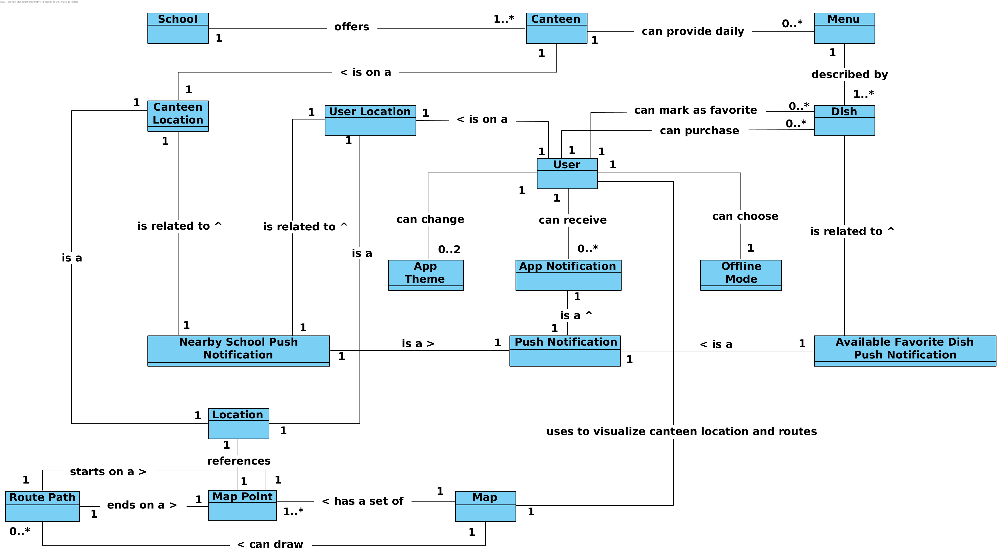

# Iteration 2

**Step 1**

- Goal: Review Inputs

- Possible Questions:

|Question|Answer|
|--------|------|
|Inputs available and correct?|As far as the feedback of the stakeholder, the defined architectural drivers are correct|
|All drivers available?|As far as what was retained from the domain problem and the stakeholder feedback, all drivers have been defined|
|Is it clearly stablished what is the purpose for the design activities?|Yes, the purpose of this iteration is to support the application primary functionalities by structuring the application in a fine-grain view|
|Have primary functionality and quality attribute scenarios been prioritized (ideally by the most important project stakeholders)?|Yes|
|Are initial architectural concerns defined?|Yes|

**Step 2**

- Goal: Establish iteration goal by selecting drivers

#### Kanban Board

| Not Addressed | Partially Addressed | Addressed |
|---------------|---------------------|-----------|
| UC-1 |||
| UC-2 |||
| UC-3 |||
| UC-4 |||
| UC-5 |||
| UC-6 |||
| UC-7 |||
| UC-8 |||
| UC-9 |||
| UC-10 |||
| UC-11 |||
| UC-12 |||
| UC-13 |||
| CON-1 |||
| CRN-1 |||
| QA-1 |||
| QA-2 |||

**Step 3**

- Goal: Choose elements of the system to refine

  - IPEM

**Step 4**

- Goal: Choose one or more design concepts that satisfy the selected drivers

Given the iteration goal selected drivers in Step 2, it is necessary to define which design concepts will be taken in account to realize the elements to refine selected in Step 3. The design concents proposed are the following:

|Design Decisions and Location|Rationale|
|-----------------------------|---------|
|Adopt MVP architectural pattern as IPEM architecture|MVP (Model View Presenter) proposed that there is a middleman between the view and the model in order to make the view agnostic of the model. This middleman (presenter) acts as a controller between the model and the view, and by creating this indirection it is possible to manage the model data before sending to the view, removing view responsibility of having to deal with data validation. Android by default already promotes MVP as the view is represented in XML files, representing views groups that are composed by other view groups or views  with references to primitive types. The adoption of this architectural pattern supports the concretization of UC-1, UC-2, UC-3, UC-4, UC-5, UC-6, UC-7, UC-8, UC-9, UC-10, UC-11, UC-12, UC-13|
|Adopt [alternative resources switching](https://developer.android.com/guide/topics/resources/localization#creating-alternatives) strategy for localizing the application|Android provides a localization mechanism that takes as input the application resources structure. By creating alternative resources for each supported language, Android will automatically selected the desired resources based on the device language (e.g. Defining Japanese strings in `res/values-ja/strings.xml`, Android will automatically load these if the device language is identified as Japanese. The adoption of this strategy supports the concretization of CRN-1 and QA-2|
|Use [`Room Persistence Library`](https://developer.android.com/topic/libraries/architecture/room) for SQLite database management|Room Persistence Library provides an abstraction layer over SQLite allowing database access through the use of a *Fluent API*. The use of this library will decrease the time wasted on managing the access of the SQLite database as the developers are unexperienced in this field. As Room is a well tested solution provided by Google Android Developers, the disrespect of CON-1 will most likely not be affected as issues regarding memory leaks and heavy resource processing are responsibility of the library. Adopting room will support the concretization of UC-12|
|Use Singleton pattern for centralizing the access of the database context object|Room provides an object entitled as `AppDatabase` in order to allow the access of database functionalities defined in compile time. As stated in the [documentation](https://developer.android.com/training/data-storage/room/index.html#java) applications that use Room should adapt the singleton pattern for permiting the access of the `AppDatabase` object *as each `RoomDatabase` object instance is fairly expensive* and its rarely needed multiple instances per single process. The adoption of this pattern affects CON-1 (positively)|

|Alternative|Rationale|
|-----------|---------|
|MVC architectural pattern as IPEM architecture|Model View Controller could also be adopted in IPEM, yet it is prefered to adopt MVP as by default Android already promotes it and by adopting it the view doesn't need to know which model its representing|
|SQLite Android API|Traditional SQLite Android API could also be used for database access, yet as explained above Room was preffered as the team is not experienced with relational database|

**Step 5**

- Goal: Instantiate architectural elements, allocate responsibilities and define interfaces

To satisfy the structure of the chosen design concepts, the following elements are proposed to be created:

|Design Decisions and Location|Rationale|
|-----------------------------|---------|
|Elaborate domain model|Domain model allows the identification of business concepts, which are necessary to address the selected drivers (UC-1, UC-2, UC-3, UC-4, UC-5, UC-6, UC-7, UC-8, UC-9, UC-10, UC-11, UC-12, UC-13, CON-1, CRN-1, QA-1 and QA-2)|
|Map use cases by actors|To establish actors and their responbilities it is necessary to map the use cases being addressed by their actors|
|Map use cases to domain objects|Domain objects of use cases help in identifying the dependencies existent for each use case|
|Elaborate IPEM structure using packages|In order to comprehend how the application is structured, it is necessary to define the structure of the application using packages|
|Decompose IPEM in smaller components|In order to comprehend how MVP architectural pattern applies in IPEM it is necessary to decompose it in a fine-grain view|

**Step 6**

- Goal: Sketch views and record design decisions

### Module View

#### Domain Model

